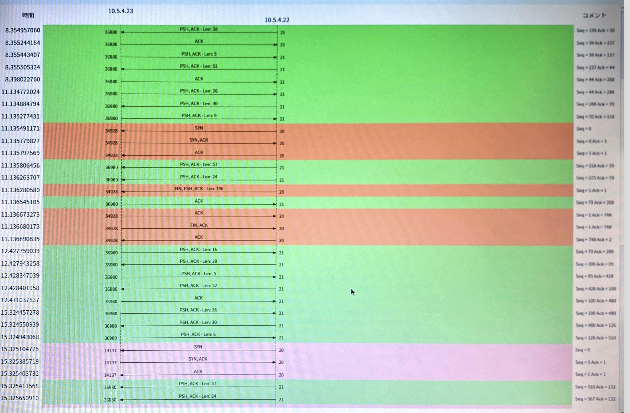

# 3週目

## 課題1


pingはInternet Control Message Protocol(ICMP)で、TCPパケットのデータの部分にICMPメッセージが格納されている。

この時は、Typeが8なのでEcho Requestのメッセージであり、Type8にはCodeが0のパターンしかない


この時は、Typeが8なのでEcho Replyのメッセージであり、Type0にはCodeが0のパターンしかない

[参考リンク](https://www.infraexpert.com/study/tcpip4.html)


## 課題2


ICMPとUDPのパケットがあった。

ICMPではTCPのTTLとICMPのTTLがあり、TCPのTTLは64、ICMPは1だったので、重複する場合にはICMPのTTLが適用されるまたは小さい方が適用されるのだろうと考えられる。


tracerouteのudpはTTLが一つしかなかったが、これはICMPプロトコルでないためだと考えられる。


ICMPとUDPそれぞれ3回ずつパケットがきた


## 課題3
自前のPCで
```shell
echo 'Tanaka Youichirou' >  ~/My_Name.txt
```

だるいので確認用PCの~/.netrcを設定する
```rc
machine asato
login mint08
password MiNT08
```

FTPで
```shell
ftp asato
> cd ../rc4ie22
> get My_Name.txt
> exit
```

それWiresharkで観測すると

分析→追跡→TCPストリームで


統計→フローチャートでポート番号を確認する。


うーん21番!

```shell
ftp -A asato # アクティブモード
```
アクティブモードのポート番号を確認する


パッシブモードのポート番号を確認する

```shell
ftp -p asato # パッシブモード
```


## 課題4
```shell
telnet -l rc4ie22 asato
User: # Enter
Password: # RC4IE22

hostname

exit
```

ワイヤーシャーク


TCPストリーム


暗号化


フローグラフ


ポート番号23

## 課題5
```shell
ssh rc4ie22@asato
password: # RC4IE22
```
ワイヤーシャーク


フローグラフ


TCPストリーム


中身


ポート番号22